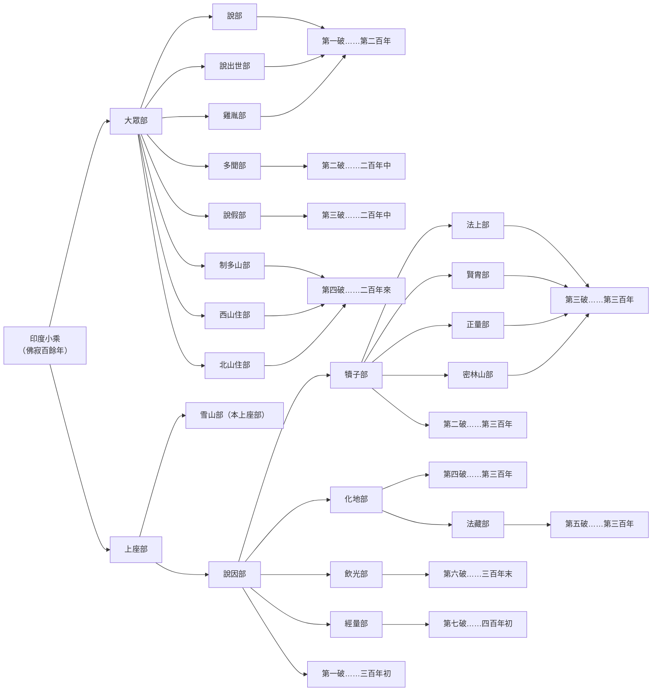

```mermaid
graph LR
    A["印度小乘<br>（佛寂百餘年）"] --> B["大眾部"]
    A --> C["上座部"]

    %% 大眾部分支
    B --> B1["說部"]
    B --> B2["說出世部"]
    B --> B3["雞胤部"]
    B --> B4["多聞部"]
    B --> B5["說假部"]
    B --> B6["制多山部"]
    B --> B7["西山住部"]
    B --> B8["北山住部"]

    %% 大眾部破法時間線
    B1 & B2 & B3 --> B9["第一破……第二百年"]
    B4 --> B10["第二破……二百年中"]
    B5 --> B11["第三破……二百年中"]
    B6 & B7 & B8 --> B12["第四破……二百年來"]

    %% 上座部分支
    C --> C1["雪山部（本上座部）"]
    C --> C2["說因部"]

    %% 說因部分支
    C2 --> C3["犢子部"]
    C2 --> C4["化地部"]
    C2 --> C5["飲光部"]
    C2 --> C6["經量部"]

    %% 犢子部分支
    C3 --> C3a["法上部"]
    C3 --> C3b["賢胄部"]
    C3 --> C3c["正量部"]
    C3 --> C3d["密林山部"]

    %% 上座部破法時間線
    C2 --> D1["第一破……三百年初"]
    C3 --> D2["第二破……第三百年"]
    C3a & C3b & C3c & C3d --> D3["第三破……第三百年"]
    C4 --> D4["第四破……第三百年"]
    C4 --> C4a["法藏部"]
    C4a --> D5["第五破……第三百年"]
    C5 --> D6["第六破……三百年末"]
    C6 --> D7["第七破……四百年初"]
```