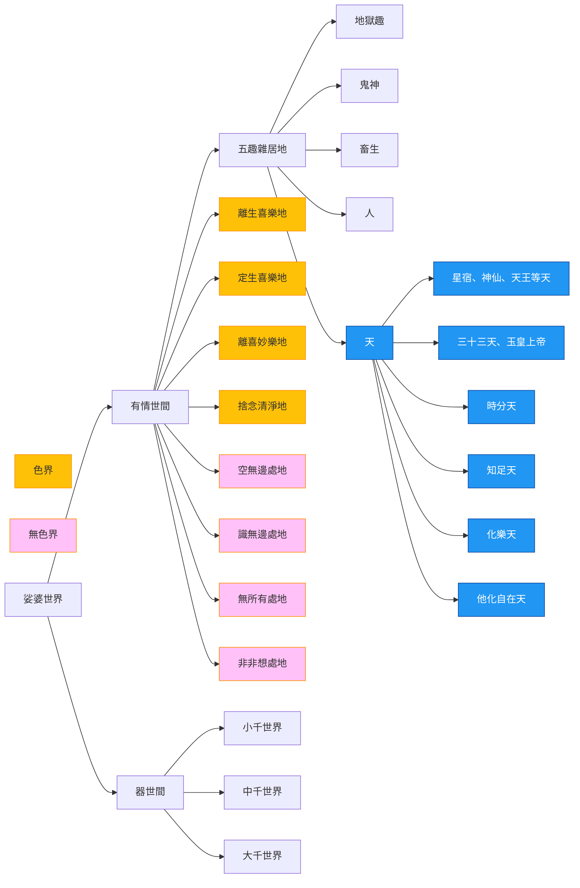

```mermaid
graph LR
classDef blueNode fill:#2196f3,stroke:#0d47a1,color:#fff
classDef rupaNode fill:#ffc107,stroke:#ff8f00
classDef arupaNode fill:#ffc1f7,stroke:#ff8f00

    D[色界]:::rupaNode
    E[無色界]:::arupaNode
    A[娑婆世界] --> B[有情世間]
    A --> C[器世間]
    B --> B1[五趣雜居地]
    B --> B2[離生喜樂地]:::rupaNode
    B --> B3[定生喜樂地]:::rupaNode
    B --> B4[離喜妙樂地]:::rupaNode
    B --> B5[捨念清淨地]:::rupaNode
    B --> B6[空無邊處地]:::arupaNode
    B --> B7[識無邊處地]:::arupaNode
    B --> B8[無所有處地]:::arupaNode
    B --> B9[非非想處地]:::arupaNode
    B1 --> B1a[地獄趣]
    B1 --> B1b[鬼神]
    B1 --> B1c[畜生]
    B1 --> B1d[人]
    B1 --> B1e[天]:::blueNode
    B1e --> B1e1[星宿、神仙、天王等天]:::blueNode
    B1e --> B1e2[三十三天、玉皇上帝]:::blueNode
    B1e --> B1e3[時分天]:::blueNode
    B1e --> B1e4[知足天]:::blueNode
    B1e --> B1e5[化樂天]:::blueNode
    B1e --> B1e6[他化自在天]:::blueNode
    C --> C1[小千世界]
    C --> C2[中千世界]
    C --> C3[大千世界]

```