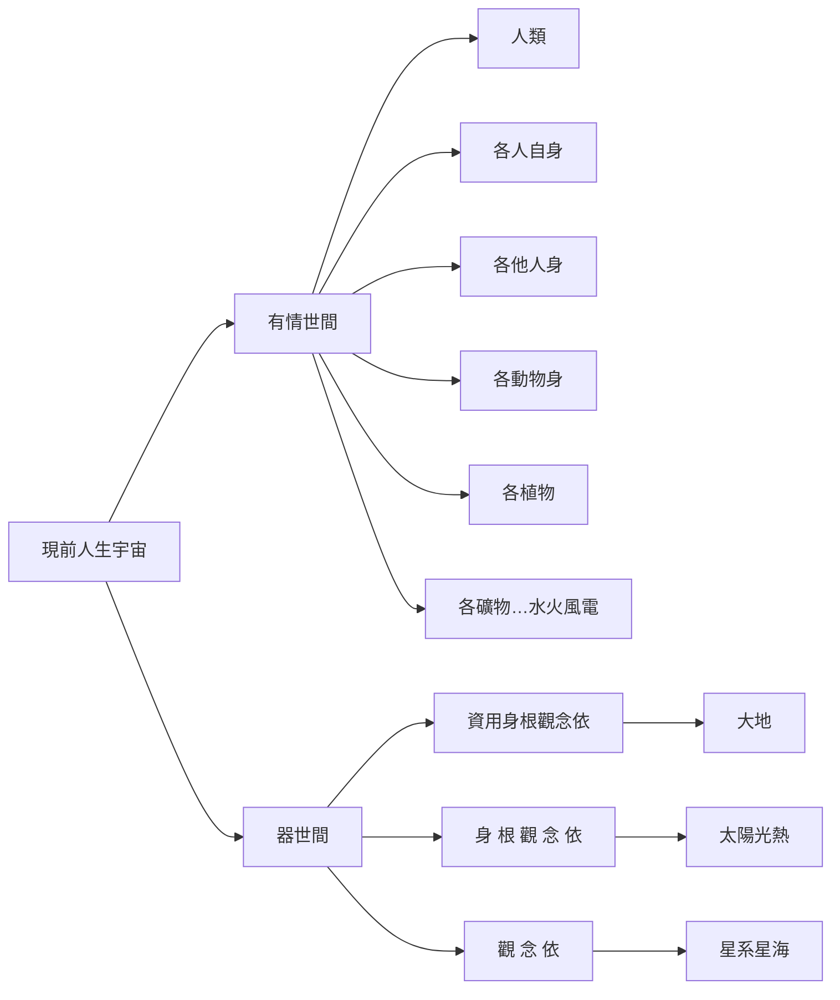

```mermaid
graph LR
    A[現前人生宇宙] --> B[有情世間]
    A --> C[器世間]
    B --> B1[人類]
    B --> B2[各人自身]
    B --> B3[各他人身]
    B --> B4[各動物身]
    B --> B5[各植物]
    B --> B6[各礦物…水火風電]
    C --> C1[資用身根觀念依]
    C --> C2[身 根 觀 念 依]
    C --> C3[觀 念 依]
    C1 --> C1a[大地]
    C2 --> C2a[太陽光熱]
    C3 --> C3a[星系星海]
```