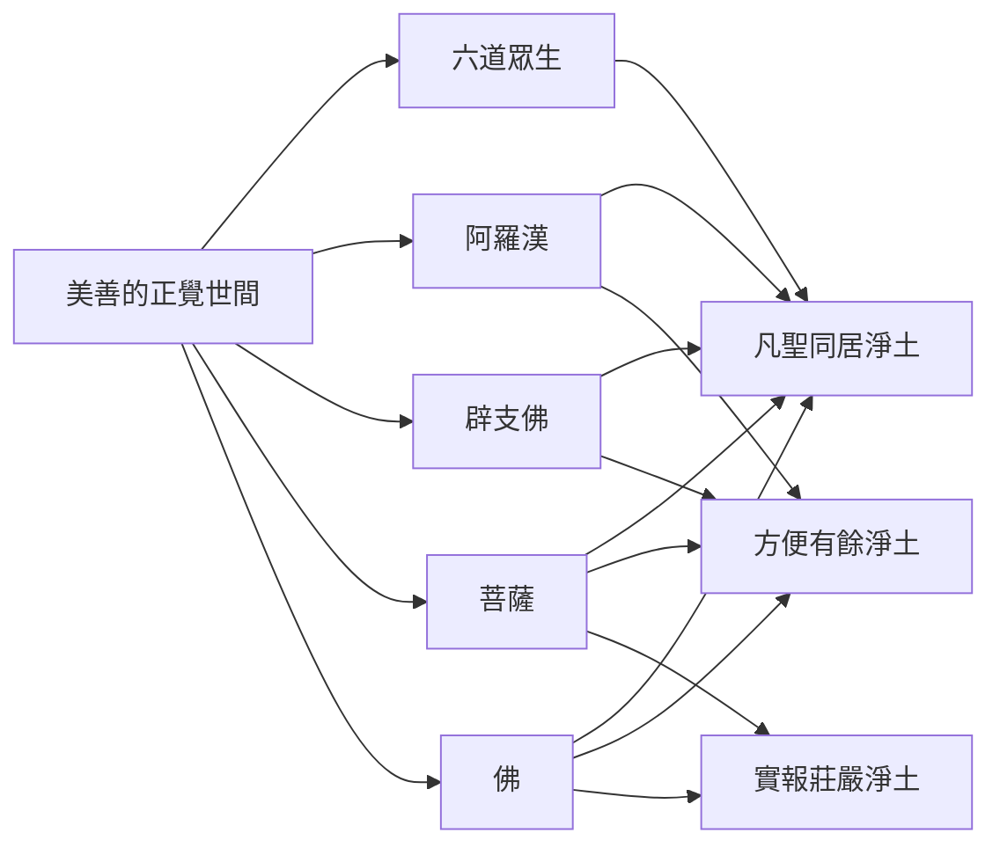

```mermaid
graph LR
    A[美善的正覺世間] --> B[六道眾生]
    A --> C[阿羅漢]
    A --> D[辟支佛]
    A --> E[菩薩]
    A --> F[佛]
    B --> G[凡聖同居淨土]
    C --> G
    D --> G
    E --> G
    F --> G
    D --> H[方便有餘淨土]
    C --> H     
    E --> H
    F --> H
    E --> I[實報莊嚴淨土]
    F --> I
```