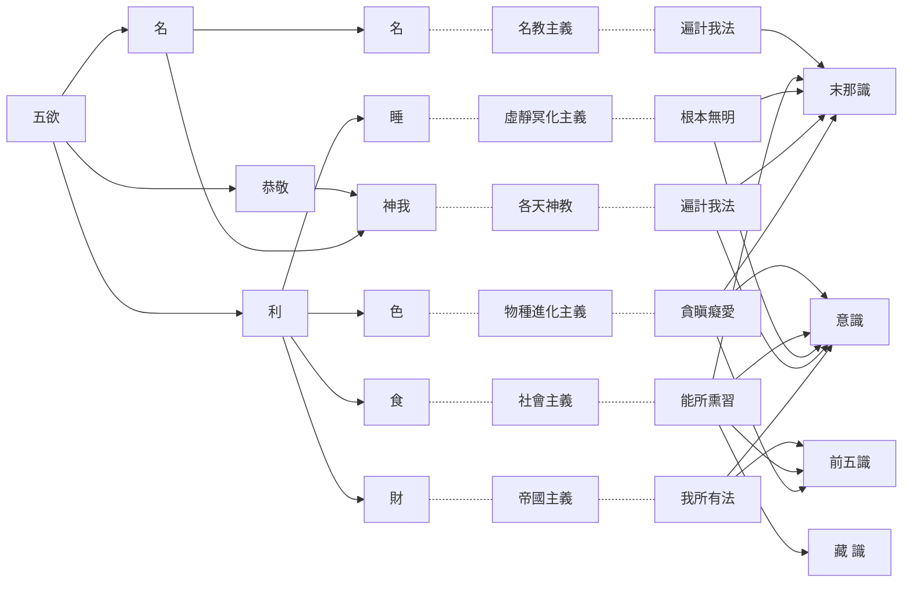

```mermaid
graph LR
    A[五欲] --> B[名]
    A --> C[利]
     A --> D[恭敬]
    C --> B1[財]
    C --> B2[色]
    B --> B3[名]
    C --> C1[食]
    C --> C2[睡]
    
    D --> D1[神我]
    B ---> D1

  B1  -.- E1[帝國主義]
  B2 -.-  E2[物種進化主義]
  B3  -.- E3[名教主義]
  C1  -.- E4[社會主義]
  C2  -.- E5[虛靜冥化主義]
  D1  -.- E6[各天神教]
  E1  -.- F1[我所有法]
  E2  -.- F2[貪瞋癡愛]
  E3  -.- F3[遍計我法]
  E4  -.- F4[能所熏習]
  E5  -.- F5[根本無明]
  E6  -.- F6[遍計我法]

    F1 --> E[前五識]
    F2 --> F[意識]
    F3 --> G[末那識]
    F4 --> H[藏 識]
   F4 --> E
  F4 --> F
  F4 --> G
  F5 --> F
   F5 --> G
    F6 --> F
   F6 --> G
    F1 --> F
F2 --> E
F2 --> G
```