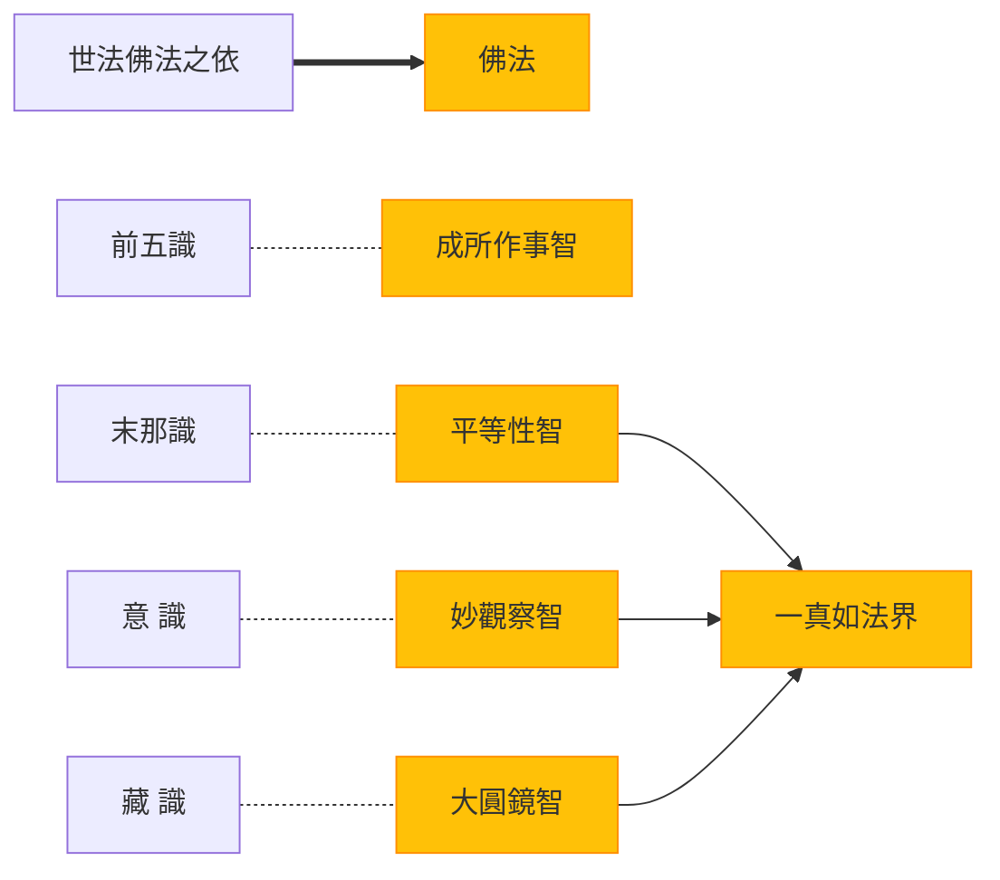

```mermaid
graph LR
classDef dhammaNode fill:#ffc107,stroke:#ff8f00
   
    A[世法佛法之依]
    A ==> BB[佛法]:::dhammaNode
    D[前五識]
    E[意 識]
    F[末那識]
    G[藏 識]
    D -.- D1[成所作事智]:::dhammaNode
    E -.- E1[妙觀察智]:::dhammaNode
    F -.- F1[平等性智]:::dhammaNode
    G -.- G1[大圓鏡智]:::dhammaNode
    F1 --> H[一真如法界]:::dhammaNode
    E1 --> H
     G1 --> H
    
```