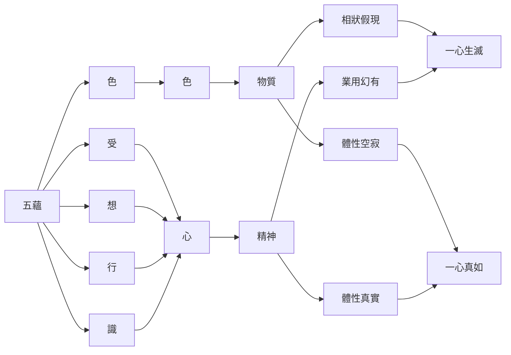

```mermaid
graph LR
    A[五蘊] --> B[色]
    A --> C[受]
    A --> D[想]
    A --> E[行]
    A --> F[識]
    B --> B1[色]
    B1 --> B2[物質]
    B2 --> B3[相狀假現]
    B2 --> B4[體性空寂]
    B3 --> G[一心生滅]
    C --> H[心]
    D --> H
    E --> H
    F --> H
    H --> H1[精神]
    H1 --> H2[業用幻有]
    H1 --> H3[體性真實]
    H2 --> G
    B4 --> I[一心真如]
    H3 --> I
```