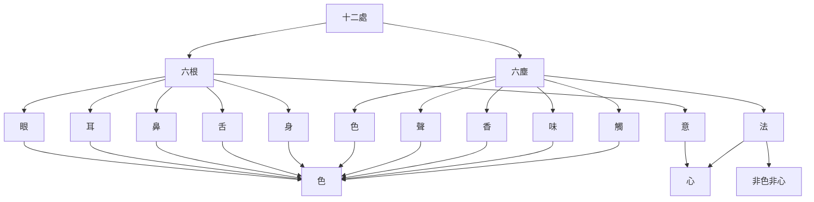

```mermaid
    graph TD
    A[十二處] --> B[六根]
    A --> C[六塵]

    %% 六根分支
    B --> B1[眼]
    B --> B2[耳]
    B --> B3[鼻]
    B --> B4[舌]
    B --> B5[身]
    B --> B6[意]

    %% 六塵分支
    C --> C1[色]
    C --> C2[聲]
    C --> C3[香]
    C --> C4[味]
    C --> C5[觸]
    C --> C6[法]

    %% 六根 → 色/心
    B1 --> D[色]
    B2 --> D
    B3 --> D
    B4 --> D
    B5 --> D
    B6 --> E[心]

    %% 六塵 → 色/心/非色非心
    C1 --> D
    C2 --> D
    C3 --> D
    C4 --> D
    C5 --> D
    C6 --> F[非色非心]
    C6 --> E
```