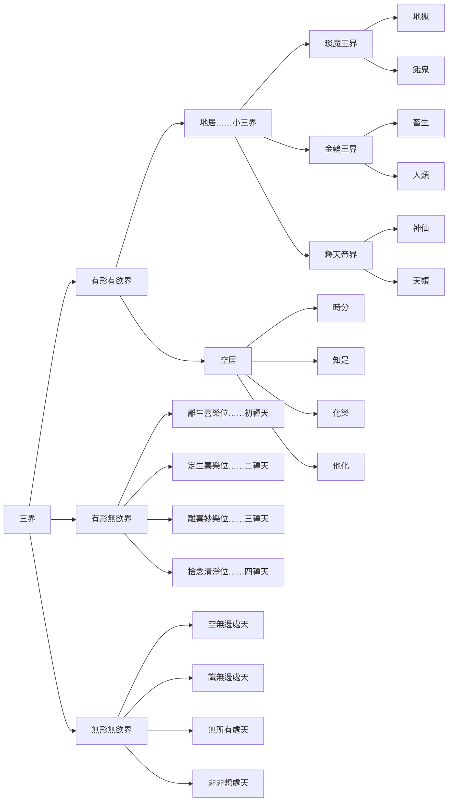

```mermaid

graph LR
    A[三界] --> B[有形有欲界]
    A --> C[有形無欲界]
    A --> D[無形無欲界]
    B --> B1[地居……小三界]
    B --> B2[空居]
    B1 --> B1a[琰魔王界]
    B1 --> B1b[金輪王界]
    B1 --> B1c[釋天帝界]
    B1a --> B1a1[地獄]
    B1a --> B1a2[餓鬼]
    B1b --> B1b1[畜生]
    B1b --> B1b2[人類]
    B1c --> B1c1[神仙]
    B1c --> B1c2[天類]
    B2 --> B2a[時分]
    B2 --> B2b[知足]
    B2 --> B2c[化樂]
    B2 --> B2d[他化]
    C --> C1[離生喜樂位……初禪天]
    C --> C2[定生喜樂位……二禪天]
    C --> C3[離喜妙樂位……三禪天]
    C --> C4[捨念清淨位……四禪天]
    D --> D1[空無邊處天]
    D --> D2[識無邊處天]
    D --> D3[無所有處天]
    D --> D4[非非想處天]
```