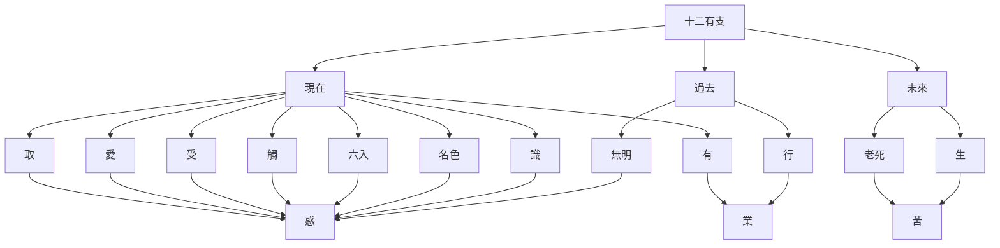

```mermaid
graph TD
    A[十二有支] --> B[過去]
    A --> C[現在]
    A --> D[未來]
    B --> B1[無明]
    B --> B2[行]
    C --> C1[識]
    C --> C2[名色]
    C --> C3[六入]
    C --> C4[觸]
    C --> C5[受]
    C --> C6[愛]
    C --> C7[取]
    C --> C8[有]
    D --> D1[生]
    D --> D2[老死]
    B1 --> E[惑]
    B2 --> F[業]
    C1 --> E
    C2 --> E
    C3 --> E
    C4 --> E
    C5 --> E
    C6 --> E
    C7 --> E
    C8 --> F
    D1 --> G[苦]
    D2 --> G
```