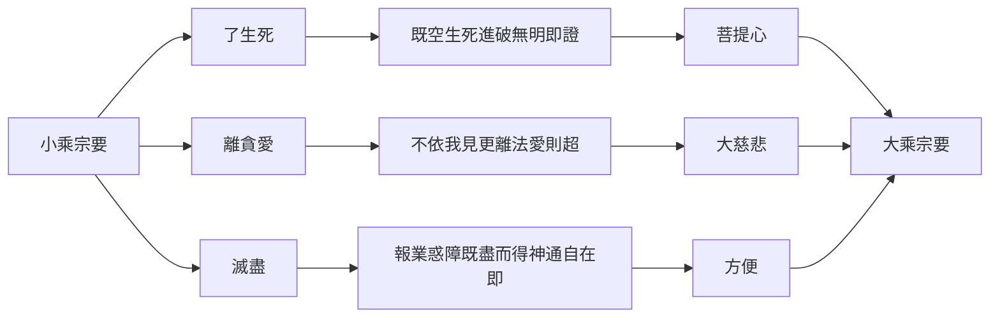

```mermaid
graph LR
    A[小乘宗要] --> B[了生死]
    A --> C[離貪愛]
    A --> D[滅盡]
    B --> B1[既空生死進破無明即證]
    C --> C1[不依我見更離法愛則超]
    D --> D1[報業惑障既盡而得神通自在即]
    B1 --> E[菩提心]
    C1 --> F[大慈悲]
    D1 --> G[方便]
    E --> H[大乘宗要]
    F --> H
    G --> H
```