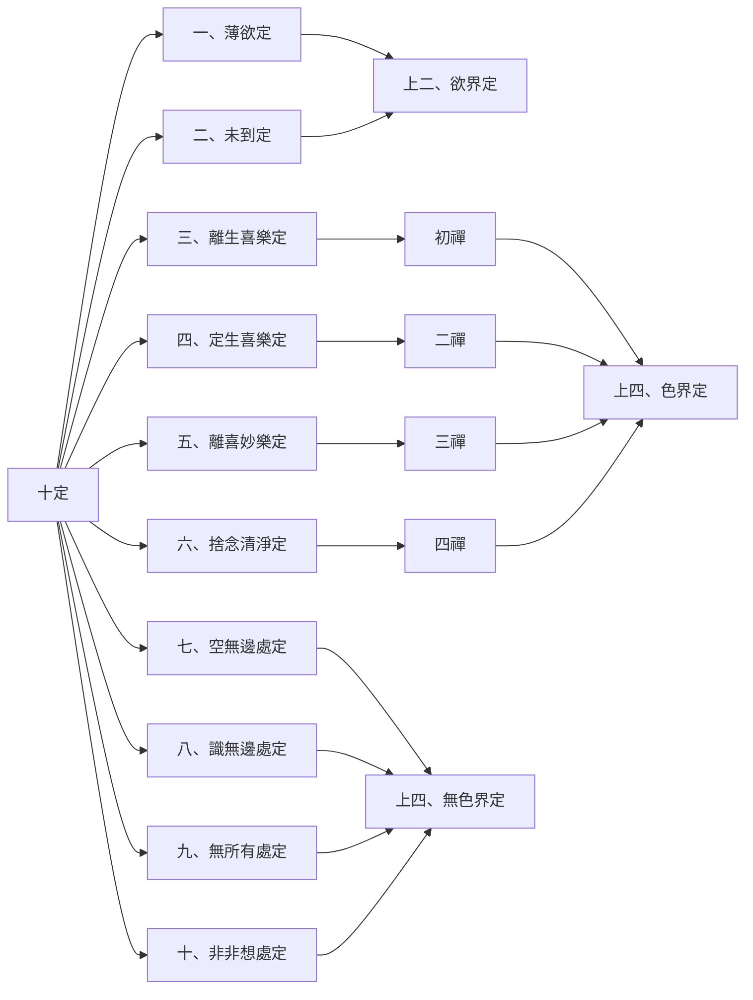

```mermaid
graph LR
    A[十定] --> B[一、薄欲定]
    A --> C[二、未到定]
    A --> D[三、離生喜樂定]
    A --> E[四、定生喜樂定]
    A --> F[五、離喜妙樂定]
    A --> G[六、捨念清淨定]
    A --> H[七、空無邊處定]
    A --> I[八、識無邊處定]
    A --> J[九、無所有處定]
    A --> K[十、非非想處定]

    B & C --> L[上二、欲界定]
    D --> M[初禪]
    E --> N[二禪]
    F --> O[三禪]
    G --> P[四禪]
    M & N & O & P --> Q[上四、色界定]
    H & I & J & K --> R[上四、無色界定]
```