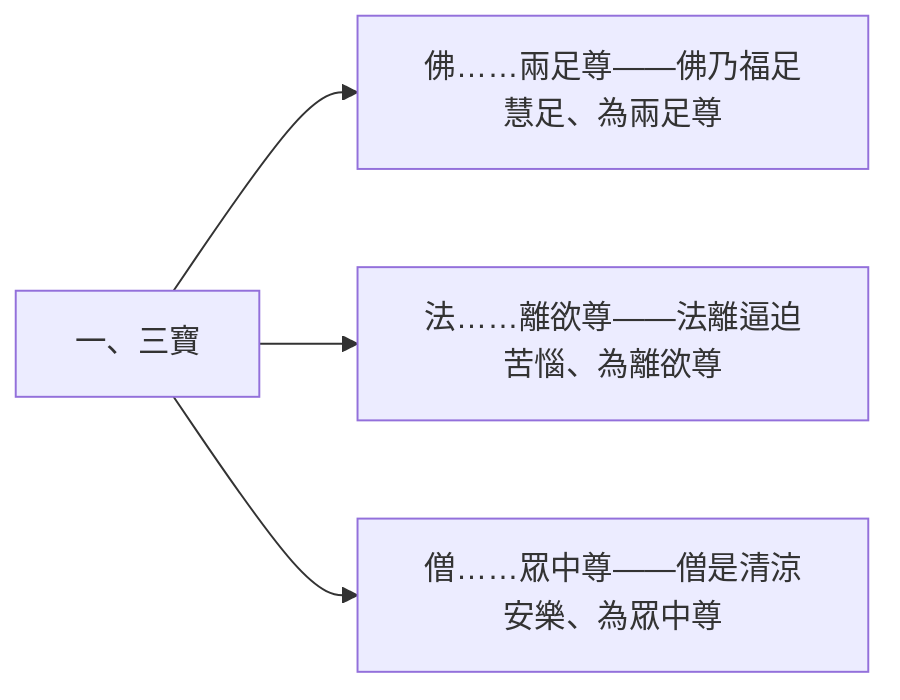
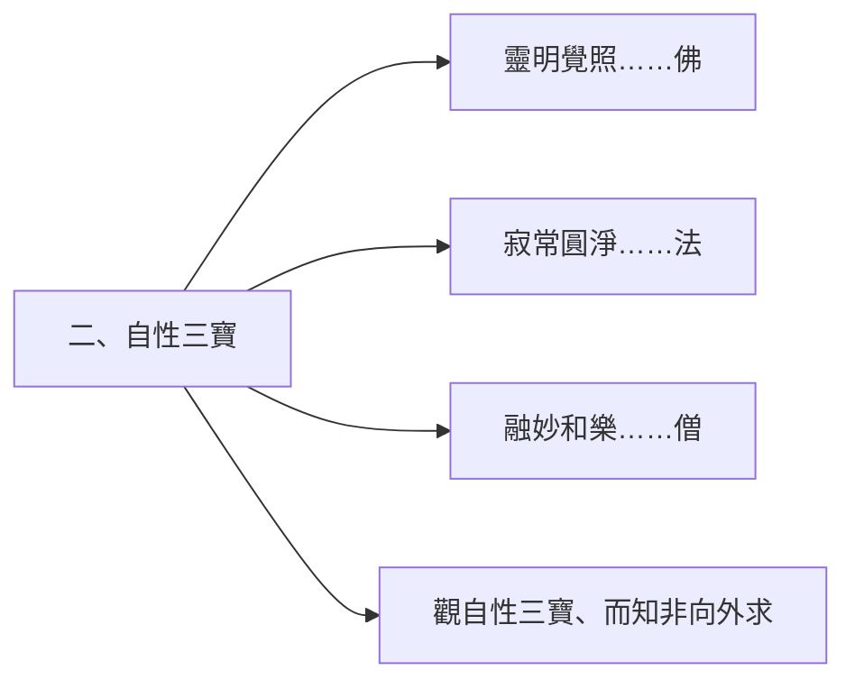
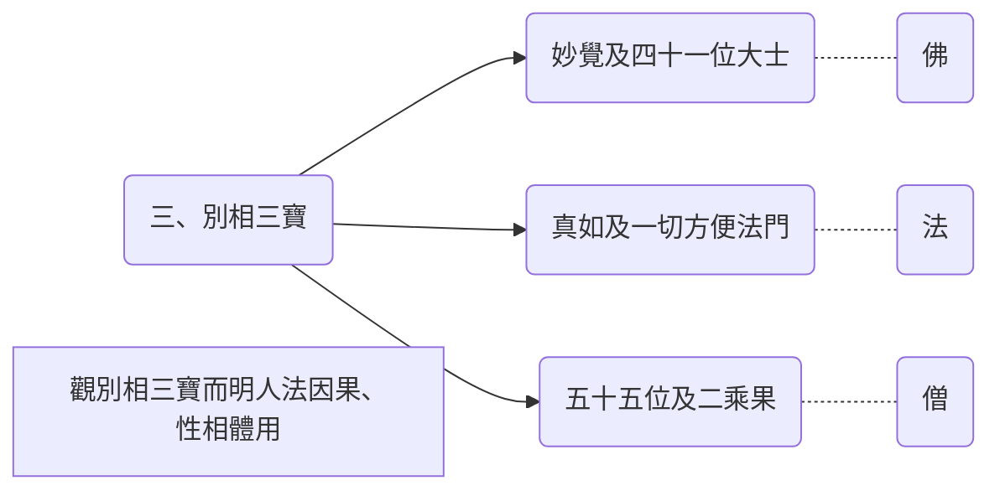
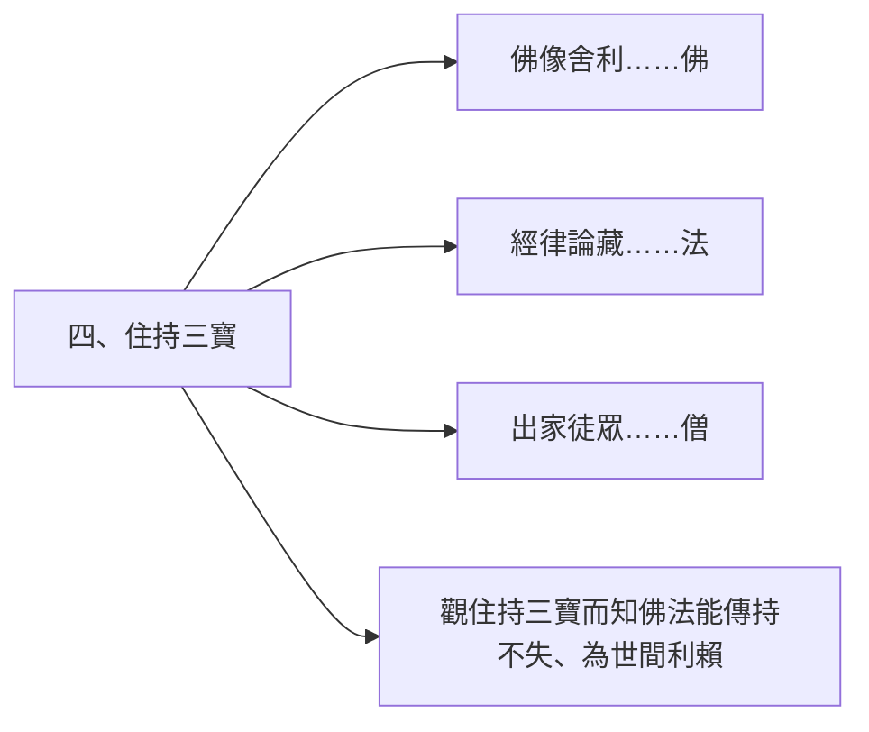

```mermaid
graph LR
    A[一、三寶] --> A1[佛……兩足尊——佛乃福足慧足、為兩足尊]
    A --> A2[法……離欲尊——法離逼迫苦惱、為離欲尊]
    A --> A3[僧……眾中尊——僧是清涼安樂、為眾中尊]
```

```mermaid
graph LR
    B[二、自性三寶] --> B1[靈明覺照……佛]
    B --> B2[寂常圓淨……法]
    B --> B3[融妙和樂……僧]
    B --> B4[觀自性三寶、而知非向外求]
```

```mermaid
graph LR
    C(三、別相三寶) --> C1(妙覺及四十一位大士)
    C1 -.- D1(佛)
    C --> C2(真如及一切方便法門)
    C2 -.- D2(法)
    C --> C3(五十五位及二乘果)
    C3 -.- D3(僧)
    E[觀別相三寶而明人法因果、性相體用]
```

```mermaid
graph LR
    D[四、住持三寶] --> D1[佛像舍利……佛]
    D --> D2[經律論藏……法]
    D --> D3[出家徒眾……僧]
    D --> D4[觀住持三寶而知佛法能傳持不失、為世間利賴]
```