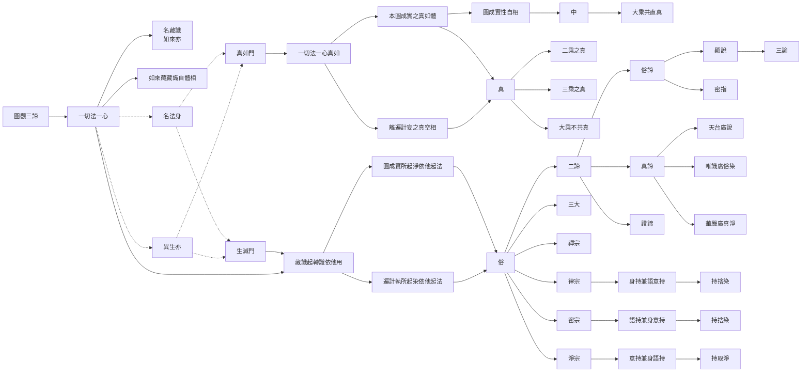

```mermaid
graph LR
    %% 左侧起点
    A[圓觀三諦] --> B[一切法一心]
    B --> B1[名藏識<br>如來亦]
    B --> B2[如來藏藏識自體相]
    B --> B3[藏識起轉識依他用]
    B -.-> C[異生亦]
    B -.-> D[名法身]
    C -.-> E[真如門]
    C -.-> F[生滅門]
    D -.-> E
    D -.-> F
    E --> G[一切法一心真如]
    G --> G1[離遍計妄之真空相]
    G --> G2[本圓成實之真如體]
    G2 --> G3[圓成實性自相]
    F --> B3
    B3 --> B3a[遍計執所起染依他起法]
    B3 --> B3b[圓成實所起淨依他起法]

    %% 中间真/中/俗
    G1 --> H[真]
    G2 --> H
    G3 --> I[中]
    B3a --> J[俗]
    B3b --> J

    %% 中间宗派分支
    H --> K[二乘之真]
    H --> L[三乘之真]
    H --> M[大乘不共真]
    I --> N[大乘共直真]
    J --> O[二諦]
    J --> P[三大]
    J --> Q[禪宗]
    J --> R[律宗]
    J --> S[密宗]
    J --> T[淨宗]

    %% 右侧谛理分支
    O --> O1[俗諦]
    O --> O2[真諦]
    O --> O3[證諦]
    O1 --> O1a[顯說]
    O1 --> O1b[密指]
    O1a --> O1a1[三諭]
    O2 --> O2a[天台廣說]
    O2 --> O2b[唯識廣俗染]
    O2 --> O2c[華嚴廣真淨]

    %% 持法分支
    R --> R1[身持兼語意持]
    S --> S1[語持兼身意持]
    T --> T1[意持兼身語持]
    R1 --> R1a[持捨染]
    S1 --> S1a[持捨染]
    T1 --> T1b[持取淨]
```